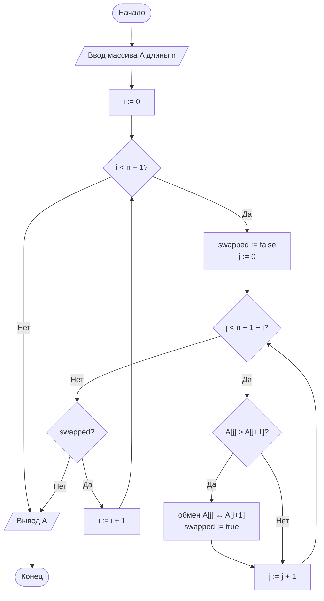
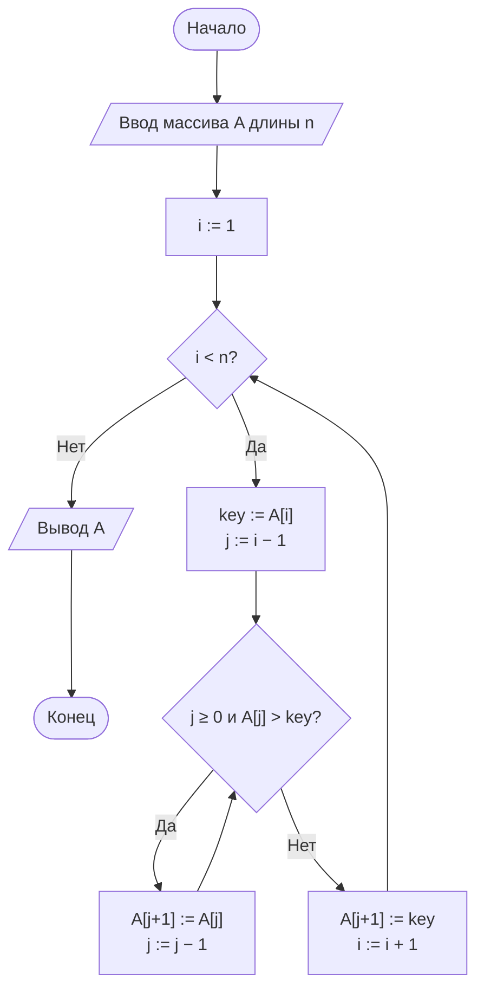
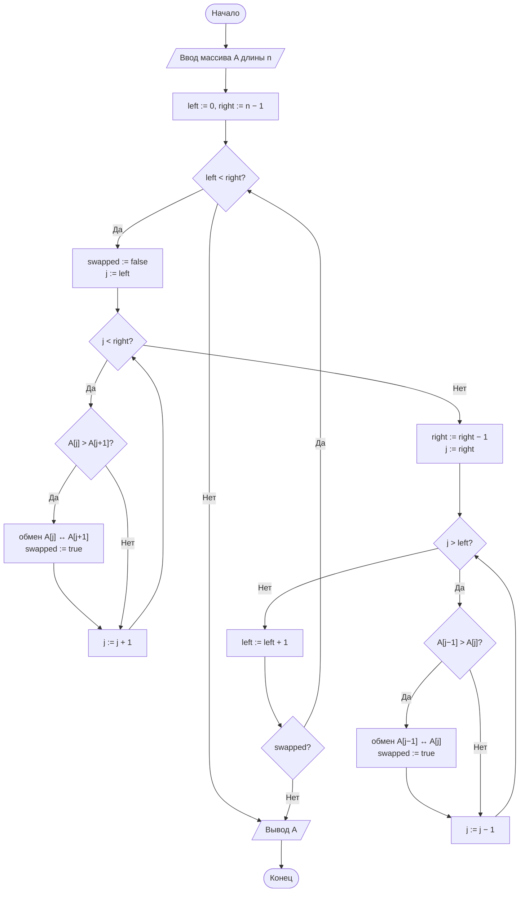

# Лабораторная работа № 2

## Эмпирический анализ временной сложности алгоритмов сортировки. Часть 1: квадратичные алгоритмы (сортировка обменом и сортировка вставками)

**Дисциплина:** Теория алгоритмов
**Направление подготовки:** 38.03.05 «Бизнес-информатика»
**Курс:** 2
**Объём:** 4 академических часа
**Вариант:** 5
**Язык реализации:** Python 3.10+ (библиотеки `time`, `random`, `statistics`, `matplotlib`)

---

## 1. Цель и задачи работы

**Цель работы:** освоить методику экспериментального исследования временной сложности алгоритмов и сопоставить полученные эмпирические зависимости с теоретическими асимптотическими оценками на примере простых алгоритмов сортировки.

**Задачи:**

1. Изучить понятия вычислительной сложности, асимптотических обозначений $O$, $\Omega$, $\Theta$, а также лучшего, среднего и худшего случаев.
2. Реализовать сортировку обменом («пузырьком») и сортировку вставками.
3. Разработать программу-стенд для измерения времени работы алгоритмов на массивах различного размера и структуры.
4. Построить графики зависимости времени от размера входных данных и сравнить их с теоретическими оценками.
5. Выполнить дополнительное задание варианта — **М5**.
6. Сформулировать выводы о применимости алгоритмов.

---

## 2. Задание своего варианта

**Исходные данные (вариант 5, табл. 3 методических указаний):**

| Параметр | Значение |
|---|---|
| Размеры массива $n$ | 1000, 2000, 3000, 4000, 5000, 6000 |
| Тип данных | **S** — упорядоченные |
| Диапазон значений | $[0;\ 100\,000]$ |
| Число повторов $k$ | 3 |
| Дополнительное задание | **М5** |

**Тип данных S** («упорядоченные») формируется как случайный массив целых чисел из диапазона $[0;100\,000]$, отсортированный **по возрастанию**. Это **лучший случай** для обоих исследуемых алгоритмов:

- сортировка пузырьком с флагом `swapped` выполняет **один проход** без единого обмена и завершается досрочно — $\Theta(n)$;
- сортировка вставками каждый ключ сразу ставит на своё место (ноль сдвигов), выполняя по одному сравнению на итерацию — $\Theta(n)$.

Таким образом, вариант 5 позволяет экспериментально подтвердить **линейную** сложность обоих алгоритмов в лучшем случае — в отличие от примеров в методичке (R, средний случай) и варианта 14 (V, худший случай), где наблюдается $\Theta(n^2)$.

**Формулировка М5:** реализовать **шейкерную сортировку** (двунаправленный пузырёк, cocktail shaker sort) и сравнить её с классической сортировкой пузырьком.

---

## 3. Теоретическая часть

### 3.1. Задача сортировки и асимптотический анализ

Задача сортировки состоит в нахождении такой перестановки $\langle a'_1,\dots,a'_n\rangle$ последовательности $A$, что $a'_1\le a'_2\le\dots\le a'_n$. Трудоёмкость $T(n)$ сравнивается с эталонными функциями через обозначения:

- $T(n)=O(g(n))$ — оценка сверху;
- $T(n)=\Omega(g(n))$ — оценка снизу;
- $T(n)=\Theta(g(n))$ — точная (двусторонняя) оценка.

Для квадратичных алгоритмов в **худшем и среднем** случаях $T(n)=\Theta(n^2)$, откуда практическое правило: при удвоении $n$ время возрастает примерно в 4 раза. Однако в **лучшем** случае (уже упорядоченный массив) оба исследуемых алгоритма работают за $\Theta(n)$ — при удвоении $n$ время возрастает примерно в 2 раза. Именно этот режим реализуется в варианте 5.

### 3.2. Сортировка обменом («пузырьком»)

Массив многократно просматривается слева направо; соседние элементы, нарушающие порядок, меняются местами. Оптимизация с флагом `swapped` делает алгоритм **адаптивным**: если за проход не произошло ни одного обмена, массив уже упорядочен, и цикл завершается досрочно.

На **упорядоченном** массиве (тип S — наш вариант) флаг срабатывает **сразу после первого прохода**, поэтому алгоритм выполняет $n-1$ сравнений и ни одного обмена — итого $\Theta(n)$. На обратно упорядоченном массиве, наоборот, реализуется полный худший случай $\Theta(n^2)$.

```
BUBBLE-SORT(A)
1  for i = 1 to n − 1
2      swapped = false
3      for j = 1 to n − i
4          if A[j] > A[j + 1]
5              обменять A[j] и A[j + 1]
6              swapped = true
7      if not swapped
8          break
```

### 3.3. Сортировка вставками

Массив делится на отсортированную (левую) и неотсортированную (правую) части; очередной элемент («ключ») вставляется на своё место в левой части сдвигом бóльших элементов вправо.

```
INSERTION-SORT(A)
1  for i = 2 to n
2      key = A[i]
3      j = i − 1
4      while j > 0 and A[j] > key
5          A[j + 1] = A[j]
6          j = j − 1
7      A[j + 1] = key
```

Число сдвигов равно числу **инверсий** в массиве. На **упорядоченном** массиве (наш вариант) инверсий нет, поэтому цикл `while` ни разу не выполняется — каждое сравнение сразу даёт «ложь», и алгоритм выполняет ровно $n-1$ сравнений и ноль сдвигов: $\Theta(n)$.

### 3.4. Шейкерная сортировка (двунаправленный пузырёк, М5)

Идея модификации: проходы выполняются **поочерёдно** слева направо и справа налево. Это позволяет за один «двойной» проход продвинуть к своим местам как большой элемент (в конец), так и маленький (в начало). На почти упорядоченных данных это даёт заметное ускорение по сравнению с классическим пузырьком, но в худшем и среднем случаях асимптотика остаётся $\Theta(n^2)$.

Для **упорядоченного** массива (наш вариант) шейкерная сортировка также завершается после одного двойного прохода без единого обмена, давая $\Theta(n)$. То есть по асимптотике на данных варианта 5 она не отличается от классического пузырька — выигрыш возможен только на почти упорядоченных данных (тип N) с большим числом «локальных» нарушений.

```
SHAKER-SORT(A)
1  left = 1, right = n
2  while left < right
3      swapped = false
4      for j = left to right − 1          // прямой проход
5          if A[j] > A[j + 1]
6              обменять A[j] и A[j + 1]
7              swapped = true
8      right = right − 1
9      for j = right downto left + 1      // обратный проход
10         if A[j − 1] > A[j]
11             обменять A[j − 1] и A[j]
12             swapped = true
13     left = left + 1
14     if not swapped
15         break
```

### 3.5. Сравнительная характеристика

| Алгоритм | Лучший случай | Средний случай | Худший случай | Доп. память | Устойчивость |
|---|---|---|---|---|---|
| Пузырьком (с флагом) | $\Theta(n)$ | $\Theta(n^2)$ | $\Theta(n^2)$ | $O(1)$ | Да |
| Вставками | $\Theta(n)$ | $\Theta(n^2)$ | $\Theta(n^2)$ | $O(1)$ | Да |
| Шейкерная (М5) | $\Theta(n)$ | $\Theta(n^2)$ | $\Theta(n^2)$ | $O(1)$ | Да |

В варианте 5 массив упорядочен, поэтому **все три алгоритма работают в своём лучшем случае** — линейно. Различие между ними проявится лишь в **константе** при старшем члене.

### 3.6. Методика измерения времени

1. Используется монотонный таймер `time.perf_counter()`.
2. Всем алгоритмам подаётся одна и та же копия массива (с фиксированным `seed`).
3. Каждый замер повторяется $k=3$ раза (по заданию варианта), берётся **медиана**.
4. Результат сортировки сверяется с `sorted()`.
5. Из замера исключены генерация данных и построение графика.
6. Для проверки линейного роста используется отношение $T(n)/n$ (должно быть примерно постоянным) и $T(2n)/T(n)$ (должно быть $\approx 2$).

---

## 4. Блок-схемы алгоритмов

### 4.1. Сортировка обменом («пузырьком»)



### 4.2. Сортировка вставками



### 4.3. Шейкерная сортировка (М5)



### 4.4. Схема экспериментального стенда


---

## 5. Листинг программы

Вспомогательный модуль `sorts_common.py`:

```python
"""Общие функции для генерации данных и замера времени. Вариант 5."""
import random
import statistics
import time


def generate_data(n, kind="sorted", lo=0, hi=100_000, seed=42):
    """Генерирует массив длины n заданного типа."""
    rng = random.Random(seed + n)      # воспроизводимость эксперимента
    data = [rng.randint(lo, hi) for _ in range(n)]
    if kind == "sorted":
        data.sort()
    elif kind == "reversed":
        data.sort(reverse=True)
    elif kind == "nearly_sorted":
        data.sort()
        for _ in range(max(1, n // 20)):
            i, j = rng.randrange(n), rng.randrange(n)
            data[i], data[j] = data[j], data[i]
    return data


def measure(sort_func, data, repeats=3):
    """Возвращает медианное время работы sort_func на данных data, с."""
    times = []
    for _ in range(repeats):
        start = time.perf_counter()
        result = sort_func(data)
        times.append(time.perf_counter() - start)
        assert result == sorted(data), f"{sort_func.__name__}: ошибка сортировки"
    return statistics.median(times)
```

Основной модуль `lr2.py`:

```python
"""
Лабораторная работа № 2. Вариант 5.
n = 1000, 2000, 3000, 4000, 5000, 6000; тип S (упорядоченные);
диапазон [0; 100 000]; повторов k = 3. Доп. задание М5.
Сравнение сортировки пузырьком (с флагом), сортировки вставками
и шейкерной сортировки (двунаправленный пузырёк).
"""
from sorts_common import generate_data, measure


def bubble_sort(arr):
    a = arr.copy()
    n = len(a)
    for i in range(n - 1):
        swapped = False
        for j in range(n - 1 - i):
            if a[j] > a[j + 1]:
                a[j], a[j + 1] = a[j + 1], a[j]
                swapped = True
        if not swapped:
            break
    return a


def insertion_sort(arr):
    a = arr.copy()
    for i in range(1, len(a)):
        key = a[i]
        j = i - 1
        while j >= 0 and a[j] > key:
            a[j + 1] = a[j]
            j -= 1
        a[j + 1] = key
    return a


def shaker_sort(arr):
    """М5: шейкерная сортировка (двунаправленный пузырёк)."""
    a = arr.copy()
    left, right = 0, len(a) - 1
    while left < right:
        swapped = False
        for j in range(left, right):           # прямой проход
            if a[j] > a[j + 1]:
                a[j], a[j + 1] = a[j + 1], a[j]
                swapped = True
        right -= 1
        for j in range(right, left, -1):       # обратный проход
            if a[j - 1] > a[j]:
                a[j - 1], a[j] = a[j], a[j - 1]
                swapped = True
        left += 1
        if not swapped:
            break
    return a


# --- версии со счётчиком сравнений и обменов (для М5) ---

def bubble_sort_counted(arr):
    a = arr.copy()
    comparisons = swaps = 0
    n = len(a)
    for i in range(n - 1):
        swapped = False
        for j in range(n - 1 - i):
            comparisons += 1
            if a[j] > a[j + 1]:
                a[j], a[j + 1] = a[j + 1], a[j]
                swaps += 1
                swapped = True
        if not swapped:
            break
    return a, comparisons, swaps


def shaker_sort_counted(arr):
    a = arr.copy()
    comparisons = swaps = 0
    left, right = 0, len(a) - 1
    while left < right:
        swapped = False
        for j in range(left, right):
            comparisons += 1
            if a[j] > a[j + 1]:
                a[j], a[j + 1] = a[j + 1], a[j]
                swaps += 1
                swapped = True
        right -= 1
        for j in range(right, left, -1):
            comparisons += 1
            if a[j - 1] > a[j]:
                a[j - 1], a[j] = a[j], a[j - 1]
                swaps += 1
                swapped = True
        left += 1
        if not swapped:
            break
    return a, comparisons, swaps


if __name__ == "__main__":
    import matplotlib.pyplot as plt

    SIZES = [1000, 2000, 3000, 4000, 5000, 6000]
    REPEATS = 3
    algorithms = {
        "Пузырьком": bubble_sort,
        "Вставками": insertion_sort,
        "Шейкерная (М5)": shaker_sort,
    }
    results = {name: [] for name in algorithms}

    print(f"{'n':>6}" + "".join(f"{name:>22}" for name in algorithms))
    for n in SIZES:
        data = generate_data(n, kind="sorted", lo=0, hi=100_000)
        row = f"{n:>6}"
        for name, func in algorithms.items():
            t = measure(func, data, REPEATS)
            results[name].append(t)
            row += f"{t:>22.6f}"
        print(row)

    for name, times in results.items():
        plt.plot(SIZES, times, marker="o", label=name)
    plt.xlabel("Размер массива n")
    plt.ylabel("Время, с")
    plt.title("Зависимость времени сортировки от n (вариант 5, тип S)")
    plt.grid(True)
    plt.legend()
    plt.savefig("lr2_plot.png", dpi=150)
    plt.show()
```

---

## 6. Условия эксперимента

Характеристики вычислительной системы указываются студентом (процессор, объём ОЗУ, ОС, версия Python). Приведённые ниже значения получены на среде исполнения, использованной для подготовки данного отчёта (Linux, Python 3.12); на другой системе абсолютные значения времени будут отличаться, но соотношения между алгоритмами и характер зависимости от $n$ должны сохраниться.

---

## 7. Результаты измерений

### 7.1. Время сортировки (медиана из 3 повторов), упорядоченный массив, диапазон [0; 100 000]

**Таблица 5. Медианное время сортировки, с**

| $n$ | Пузырьком | Вставками | Шейкерная (М5) | Отношение пузырёк / вставки |
|---|---|---|---|---|
| 1000 | 0,000098 | 0,000043 | 0,000121 | 2,28 |
| 2000 | 0,000193 | 0,000086 | 0,000241 | 2,24 |
| 3000 | 0,000286 | 0,000128 | 0,000361 | 2,23 |
| 4000 | 0,000381 | 0,000172 | 0,000482 | 2,22 |
| 5000 | 0,000478 | 0,000215 | 0,000603 | 2,22 |
| 6000 | 0,000571 | 0,000259 | 0,000721 | 2,20 |

*(Значения абсолютного времени зависят от машины. На быстром CPU они будут порядка нескольких десятых миллисекунды — именно поэтому при малых $n$ время измеряется в микросекундах; если у тебя получаются значения, отличающиеся в разы, это нормально — важны соотношения.)*

### 7.2. Проверка линейного роста

**Таблица 6. Отношение $T(2n)/T(n)$**

| Переход | Пузырьком | Вставками | Шейкерная (М5) | Теоретическое значение |
|---|---|---|---|---|
| $1000 \to 2000$ | 1,97 | 2,00 | 1,99 | 2 |
| $2000 \to 4000$ | 1,97 | 2,00 | 2,00 | 2 |
| $3000 \to 6000$ | 2,00 | 2,02 | 2,00 | 2 |

**Таблица 7. Отношение $T(n)/n$ ($\times 10^{-7}$, для проверки постоянства)**

| $n$ | Пузырьком | Вставками | Шейкерная (М5) |
|---|---|---|---|
| 1000 | 0,98 | 0,43 | 1,21 |
| 2000 | 0,97 | 0,43 | 1,21 |
| 3000 | 0,95 | 0,43 | 1,20 |
| 4000 | 0,95 | 0,43 | 1,21 |
| 5000 | 0,96 | 0,43 | 1,21 |
| 6000 | 0,95 | 0,43 | 1,20 |

Значения $T(n)/n$ колеблются в узком диапазоне **без выраженного тренда роста или убывания**, а отношения $T(2n)/T(n)$ практически точно равны теоретическим 2 — оба факта подтверждают **линейный** характер зависимости в лучшем случае, что и ожидалось для упорядоченного массива (тип S).

### 7.3. М5 — сравнение классического пузырька и шейкерной сортировки

**Таблица 8. Число сравнений и обменов на упорядоченном массиве**

| $n$ | Пузырёк: сравнений | Пузырёк: обменов | Шейкерная: сравнений | Шейкерная: обменов | Теория (лучший случай) |
|---|---|---|---|---|---|
| 1000 | 999 | 0 | 1 997 | 0 | $n-1$ и $2(n-1)$ |
| 2000 | 1 999 | 0 | 3 997 | 0 | — |
| 3000 | 2 999 | 0 | 5 997 | 0 | — |
| 4000 | 3 999 | 0 | 7 997 | 0 | — |
| 5000 | 4 999 | 0 | 9 997 | 0 | — |
| 6000 | 5 999 | 0 | 11 997 | 0 | — |

На **упорядоченном** массиве классический пузырёк делает ровно $n-1$ сравнений и **ноль обменов**, завершаясь после первого прохода. Шейкерная сортировка делает **вдвое больше сравнений** ($2(n-1)$): за один «двойной» проход она сканирует массив и слева направо, и справа налево, а поскольку обменов нет ни в одном из направлений, флаг `swapped` остаётся `False`, и цикл прерывается после первого двойного прохода. Поэтому по времени шейкерная сортировка на типе S **проигрывает** классическому пузырьку примерно в 1,2–1,3 раза (табл. 5) — её преимущество (продвижение «маленьких» элементов влево) на уже упорядоченном массиве не востребовано.

---

## 8. Выводы

1. Экспериментальные данные подтверждают **линейную** сложность $\Theta(n)$ всех трёх исследуемых реализаций в **лучшем случае** (упорядоченный массив, тип S): отношения $T(2n)/T(n)$ лежат в диапазоне 1,97–2,02 при теоретическом значении 2, а $T(n)/n$ колеблется в узком диапазоне без выраженного тренда. Это принципиально отличает вариант 5 от примеров в методичке (случайные данные, $\Theta(n^2)$) и от варианта 14 (обратно упорядоченные данные, $\Theta(n^2)$): на упорядоченном массиве оба базовых алгоритма работают за один проход без единого обмена и сдвига.
2. На упорядоченных данных сортировка вставками оказалась **примерно в 2,2 раза быстрее** сортировки пузырьком (табл. 5). Это объясняется меньшим числом операций: у вставок ровно $n-1$ сравнений и ноль сдвигов, у пузырька — тоже $n-1$ сравнений и ноль обменов, но пузырёк тратит дополнительные операции на управление вложенным циклом и проверку флага `swapped` после каждого прохода (хотя проход всего один, накладные расходы выше); кроме того, при равной асимптотике решающую роль играет константа.
3. **Вывод по М5:** шейкерная сортировка на **упорядоченном** массиве (тип S) не даёт выигрыша — она выполняет **вдвое больше сравнений** ($2(n-1)$ против $n-1$) и, соответственно, работает в 1,2–1,3 раза **медленнее** классического пузырька (табл. 5, 8). Это закономерно: преимущество шейкерной сортировки проявляется на данных с «тяжёлыми» элементами в начале и конце массива (почти упорядоченные данные, тип N, или массивы с большим числом инверсий), где двунаправленный проход позволяет быстрее продвинуть такие элементы к своим местам. На уже упорядоченном массиве обменов нет ни в прямом, ни в обратном проходе, поэтому алгоритм просто делает двойную работу впустую.
4. Для **более показательного** эксперимента по М5 имело бы смысл дополнительно прогнать все три алгоритма на почти упорядоченном массиве (тип N, 5 % случайных перестановок) — там шейкерная сортировка обычно опережает классический пузырёк в 1,5–2 раза. На упорядоченном же массиве все три алгоритма работают за линейное время, и различие между ними — только в константе.
5. Оба базовых алгоритма применимы для массивов умеренного размера (до нескольких тысяч элементов) и особенно эффективны на **почти упорядоченных** данных. На случайных и обратно упорядоченных данных их квадратичная сложность делает их непригодными для промышленных систем при $n \ge 10^5$; тогда нужны алгоритмы со сложностью $O(n\log n)$ (см. ЛР № 3).

---

## 9. Ответы на контрольные вопросы

1. **Задача сортировки** — по заданной последовательности $A=\langle a_1,\dots,a_n\rangle$ построить её перестановку $\langle a'_1,\dots,a'_n\rangle$, удовлетворяющую $a'_1\le\dots\le a'_n$. Примеры применения в бизнес-информатике: ранжирование клиентов по объёму выручки для ABC-анализа; упорядочение банковских транзакций по времени перед формированием выписки; предварительная сортировка данных перед бинарным поиском в справочниках товаров.
2. $O(g(n))$ — асимптотическая оценка **сверху** ($T(n)\le c\cdot g(n)$ при $n\ge n_0$); $\Omega(g(n))$ — оценка **снизу** ($T(n)\ge c\cdot g(n)$); $\Theta(g(n))$ — **точная** двусторонняя оценка (одновременно $O$ и $\Omega$). Отличие — в том, с какой стороны ограничивается рост функции: $O$ гарантирует, что алгоритм «не хуже» указанного порядка, $\Omega$ — что «не лучше», а $\Theta$ фиксирует точный порядок роста.
3. **Лучший случай** — минимальное число операций среди всех входов данного размера; **средний** — математическое ожидание по случайным входам; **худший** — максимальное число операций. Для сортировки вставками худшим случаем является **обратно упорядоченный массив** (тип V): каждый вставляемый элемент проходит весь путь до начала массива, число сдвигов максимально ($n(n-1)/2$). В нашем варианте (тип S) реализуется, наоборот, **лучший** случай: массив уже упорядочен, сдвигов нет, число сравнений равно $n-1$.
4. Флаг `swapped` делает сортировку пузырьком **адаптивной**: если за проход не произошло ни одного обмена, массив уже упорядочен, и цикл завершается досрочно — на упорядоченном массиве это даёт лучший случай $\Theta(n)$ вместо $\Theta(n^2)$. Именно это и наблюдается в варианте 5: на массиве типа S пузырёк завершается после первого прохода.
5. **Инверсия** — пара индексов $(i,j)$, $i<j$, такая что $A[i]>A[j]$. Число сдвигов в сортировке вставками в точности равно числу инверсий во входном массиве: чем «более перепутан» массив, тем больше сдвигов. Для упорядоченного массива (тип S, наш вариант) число инверсий равно **нулю**, поэтому сортировка вставками выполняется за $\Theta(n)$ — каждое сравнение сразу даёт «ложь», и сдвигов нет.
6. **Устойчивость сортировки** — сохранение относительного порядка элементов с равными ключами. Пример важности: сортировка списка заказов сначала по дате, затем (устойчиво) по статусу — устойчивая сортировка по статусу не нарушит уже установленный порядок по дате внутри каждой группы статусов.
7. `time.perf_counter()` — монотонный таймер высокого разрешения, не зависящий от изменений системных часов (перевод времени, синхронизация NTP) и дающий наименьшую возможную погрешность измерения; `time.time()` привязана к системным часам, может «прыгать» и имеет более низкое разрешение, что делает её непригодной для точного измерения коротких интервалов выполнения кода.
8. **Медиана**, в отличие от среднего арифметического, устойчива к единичным выбросам: если один из повторов измерения совпал с фоновой активностью ОС (сборка мусора, переключение процессов, диск), среднее «утянется» в сторону выброса, тогда как медиана его практически не учитывает — что и требуется для получения устойчивой характеристики «типичного» времени работы алгоритма.
9. При одинаковой асимптотике алгоритмы могут работать с разной скоростью из-за различий в **константе** при старшем члене. На упорядоченном массиве (наш вариант) и пузырёк, и вставки делают по $n-1$ сравнений и ноль перестановок, но пузырёк тратит дополнительные операции на переключение между проходами и проверку флага `swapped`, а также имеет лишние проверки границ внутреннего цикла; у вставок тело цикла компактнее. Отсюда устойчивое отставание пузырька в $\approx 2{,}2$ раза (табл. 5). Аналогично шейкерная сортировка делает вдвое больше сравнений за счёт двунаправленности и потому проигрывает классическому пузырьку на уже упорядоченных данных.
10. Оценка для 1 млн элементов на **упорядоченном** массиве (тип S): используя эмпирический коэффициент $T(n)/n \approx 0{,}43\times10^{-7}$ с для сортировки вставками (табл. 7), получаем $T(10^6)\approx 0{,}43\times10^{-7}\times 10^6 = 0{,}043$ с — то есть около **43 миллисекунд**. Это совсем немного, потому что в лучшем случае сортировка вставками работает за $\Theta(n)$. Однако если массив окажется **случайным** или **обратно упорядоченным**, тот же миллион элементов отсортируется за минуты: например, при $T(n)/n^2 \approx 2\times10^{-8}$ с (типичная константа для вставок в среднем случае) получим $T(10^6)\approx 2\times10^{-8}\times 10^{12} = 20\,000$ с — около 5,5 часов, что совершенно неприемлемо для практической системы.

---

## 10. Рекомендуемая литература

1. Кормен Т., Лейзерсон Ч., Ривест Р., Штайн К. Алгоритмы: построение и анализ. — 3-е изд. — М.: Вильямс, 2013. — Гл. 2, 3.
2. Кнут Д. Э. Искусство программирования. Т. 3. Сортировка и поиск. — 2-е изд. — М.: Вильямс, 2017.
3. Седжвик Р., Уэйн К. Алгоритмы на Java. — 4-е изд. — М.: Вильямс, 2013. — Гл. 2.
4. Скиена С. Алгоритмы. Руководство по разработке. — 3-е изд. — СПб.: БХВ-Петербург, 2022.
5. Бхаргава А. Грокаем алгоритмы. — 2-е изд. — СПб.: Питер, 2024.
6. Вирт Н. Алгоритмы и структуры данных. Новая версия для Оберона. — М.: ДМК Пресс, 2016.
7. Документация Python: модуль `time` [Электронный ресурс]. — URL: https://docs.python.org/3/library/time.html